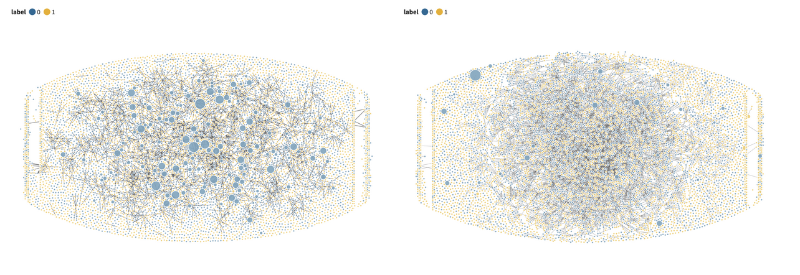

# Spot The Bot
Bot Detection Algorithm to Detect Twitter Bots

## Our Approach and Results 
Described in detail below, we developed a four-tiered approach to identify bots in our dataset: 
1. Tweet-based approach
2. Profile-based approach
3. Network-based approach
4. Combination of profile and network.  
The input to our models included feature data extracted from the rows of Twitter data (account age, number of followers/following, etc.), as well as network features we engineered. The output of our models was a prediction of whether or not a given account was a bot. We take as our criteria of success the base rate of the dataset: if we were to predict every tweet were a bot, we would achieve a roughly 60% accuracy. As such, we aim to develop a model that exceeds the base rate, aiming for 70% accuracy. 

## Tweet-Based Approach
The first tier of our approach focused on using only the tweet data to create a classifier. We decided to use a neural network for this tier, as this is similar to approaches adopted by other researchers attempting to create bot detection algorithms. For this approach, each tweet was first encoded using a GLoVE embedding. The purpose of this is to encode each tweet as a numeric value, making it easier for the machine to understand the text. The reasoning behind using a GLoVE over, for example, Word2Vec was two-fold. First, the GLoVE matrix was trained using twitter data, making it suitable for our problem. Second, the GLoVE embedding we used was only 25 dimensions, making it much more feasible given our limited computing resources. For each tweet, the resulting embedding would be the mean value across those 25 dimensions for each word in the tweet. From there, the vector was run through a multi-layer perceptron neural network, with two dense layers, and with an output layer that was run through a sigmoid activation function. The resulting output was a number between 0 and 1 that effectively was the probability of a tweet coming from a bot account.

### Results
Using a tweet-based approach did not yield results that were much higher than the base rate. The accuracy, precision, and recall of the model were .61, .60, and .88 respectively. This is not much higher than the base rate of simply classifying each tweet as a bot tweet. Therefore, we turned to different approaches to improve the model’s accuracy.

## Profile-Based Approach
### Feature Selection
The features that we are interested are as follow:  
Account age: Our dataset comes with ‘created_at’ which indicates the date of account creation. We use this information to calculate the age of an account up until 2020. In our dataset, we found that the average account age of bots tends to be lower than that of humans. We calculate the correlation between this number and the bot label outcome. We get -0.2 as a coefficient, which is significant  
Number of statuses: ‘Statuses_count’ indicates the number of tweets and retweets that an account has issued. We found that bot accounts appear to have this number higher than human accounts.
Number of favorites: ‘Favourites_count’ indicates approximately how many times a Tweet has been liked by Twitter users. We found that bot accounts appear to receive slightly less favorite than user accounts.
Screen name length: Our dataset comes with ‘screen_name’ variable which is a string of a display name of an account. We calculated the length of the screen name and used this as one of our features. According to the Bot-hunter paper, bot tends to have longer screen name length, although our EDA says otherwise: that bot and human accounts have similar screen name length.

### Model Selection
The Bot-hunter research paper stated that the two top performing models for bot classification are Random Forest and Logistic Regression. As such, we used these two models for this task. We saw that the Random Forest performs slightly better than the Logistic Regression and report those results here.

### Results
The accuracy, precision, and recall of the model were 0.65, 0.69, and 0.73 respectively. Accuracy and precision are slightly higher than the tweet-based approach and is higher than the base rate. Nevertheless, we are interested in exploring more approaches to further finetune our model

## Network-Based Approach
Next, we are interested in seeing how the way profiles connect with each other can be used to determine whether the account is a bot or not.

Network of followers (left) and Network of following (right)

### Feature selection
The first two features we select are:
1. Number of people an account follows (friends_count) and 
2. Number of followers (followers_count).  
The latter is significant in bot detection, as we find that bots tend to have less followers; the correlation coefficient is -0.17  

Next, we analyze the network of these accounts and how each of them impacts the network. Graph features are common centrality measures used in network analysis. They help to identify the importance of nodes in the graph based on different criteria. A profile account is called a node in a network. When an account follows another account then the node has a directed edge (or link) to another node.  

Here is a brief explanation of some measures that can be used in network analysis:
- *Degree centrality*: Degree centrality is a measure of the importance of a node in a network based on the number of edges it has to other nodes. If a node hasa high degree of centrality, it means that it connects with many other nodes. Degree centrality can be computed by dividing the number of links that a node has by the total number of possible links in the network.
- *PageRank*: PageRank is a centrality measure originally developed by Google for ranking webpages. It measures the probability that a random walker (or surfer) starting at a given node will visit that node, after following a large number of links in the graph.
- *Closeness centrality*: Closeness centrality measures how close a node is to all other nodes in the graph. The closeness centrality of a node is the inverse of the sum of the shortest path distances between that node and all other nodes in the network. Nodes with high closeness centrality are able to reach other nodes in the network quickly. In this context, it means that a node with high closeness centrality connects with diverse nodes that allow it to have a short path distance to all other nodes in the network. This means that an account follows diverse users in different communities in a network.
- *Eigenvector centrality*: This is a measure of a node's importance based on the importance of its neighboring nodes. A node has high eigenvector centrality if it is connected to other nodes that are themselves important. Eigenvector centrality can be used to identify influential nodes in a network. Note that in this context, the importance here is determined by the number of links a node has which mean a number of accounts a node follows.
Clustering coefficient: This measures the degree to which nodes in a graph tend to cluster together.
Betweenness centrality: Betweenness centrality measures the number of times a node appears on the shortest path between any two other nodes in the graph. Nodes with high betweenness centrality are important for maintaining the structure of the network.
- *Community detection*: This involves identifying groups of nodes in a graph that are highly interconnected with each other, but less connected to nodes outside the group. For example, we may assume that bots tend to be part of larger, more diverse communities, whereas real users tend to be part of smaller communities or clusters.  

Nevertheless, as graph analysis is usually computational expensive, we needed to balance between the efficiency and the usefulness of the features. For example, betweenness centrality and community detection require high computational resources so we do not use them in our model. We identified the following features as meaningful as well as efficient features and used them in our model. They all have a positive correlation coefficient of +0.22 with a bot label.
1. Degree centrality
2. Eigenvector centrality
3. Closeness centrality

Some features that we’ve experimented with but that do not provide better accuracy are PageRank and Average shortest path length. As such, we eliminated them from the model.

### Results
The accuracy, precision, and recall of the model were 0.71, 0.73, and 0.80 respectively. All of them are improved from the previous approaches.

## Combination of Profile-Based and Network-Based
Finally we train the model with all the features we use in profile-based approach and network-based approach. 

### Results
The accuracy, precision, and recall of the model were 0.75, 0.74, and 0.87 respectively. All of them are improved from all the previous approaches.
